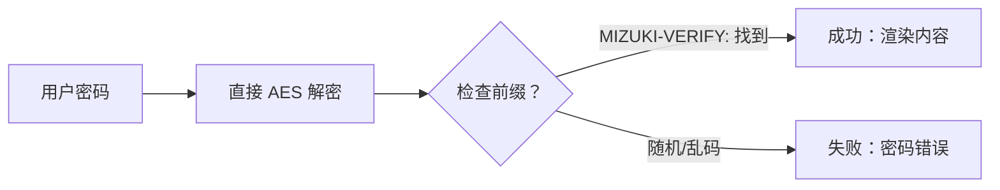

此博客模板基于 [Astro](https://astro.build/) 构建。本指南未提及的内容，你可以在 [Astro 文档](https://docs.astro.build/) 中找到答案。

## 文章前言

```yaml
---
title: My First Blog Post
published: 2023-09-09
description: This is the first post of my new Astro blog.
image: ./cover.jpg
tags: [Foo, Bar]
category: Front-end
draft: false
---
```


| 属性           | 描述                                                                                                                                                                                      |
| -------------- | ----------------------------------------------------------------------------------------------------------------------------------------------------------------------------------------- |
| `title`        | 文章的标题。                                                                                                                                                                              |
| `published`    | 文章的发布日期。                                                                                                                                                                          |
| `pinned`       | 该文章是否置顶显示在文章列表顶部。                                                                                                                                                         |
| `description`  | 文章的简短描述。显示在主页文章列表中。                                                                                                                                                     |
| `image`        | 文章的封面图片路径。<br/>1. 以 `http://` 或 `https://` 开头：使用网络图片<br/>2. 以 `/` 开头：图片位于 `public` 目录下<br/>3. 无此前缀：图片路径相对于 Markdown 文件所在目录                 |
| `tags`         | 文章的标签。                                                                                                                                                                              |
| `category`     | 文章的分类。                                                                                                                                                                              |
| `alias`        | 文章的别名。文章可通过 `/posts/{别名}/` 访问。例如：`my-special-article`（将通过 `/posts/my-special-article/` 访问）                                                                       |
| `licenseName`  | 文章内容的许可证名称。                                                                                                                                                                    |
| `author`       | 文章的作者。                                                                                                                                                                              |
| `sourceLink`   | 文章内容的来源链接或参考链接。                                                                                                                                                             |
| `draft`        | 如果文章仍为草稿状态，将不会显示。                                                                                                                                                         |

## 文章文件存放位置


你的文章文件应放置在 `src/content/posts/` 目录下。你也可以创建子目录来更好地组织文章和资源。

```
src/content/posts/
├── post-1.md
└── post-2/
    ├── cover.png
    └── index.md
```

## 文章别名

你可以通过在前言中添加 `别名` 字段来为任何文章设置别名：

```yaml
---
title: My Special Article
published: 2024-01-15
alias: "my-special-article"
tags: ["Example"]
category: "Technology"
---
```

当设置了别名时：
- 文章可以通过自定义 URL 访问（例如 `/posts/my-special-article/`）
- 默认的 `/posts/{slug}/` URL 仍然有效
- RSS/Atom 订阅将使用自定义别名
- 所有内部链接将自动使用自定义别名

**重要说明：**
- 别名不应包含 `/posts/` 前缀（系统会自动添加）
- 避免在别名中使用特殊字符和空格
- 为获得最佳 SEO 效果，建议使用小写字母和连字符
- 确保所有文章的别名唯一
- 不要包含前导或尾随斜杠


## How It Works


